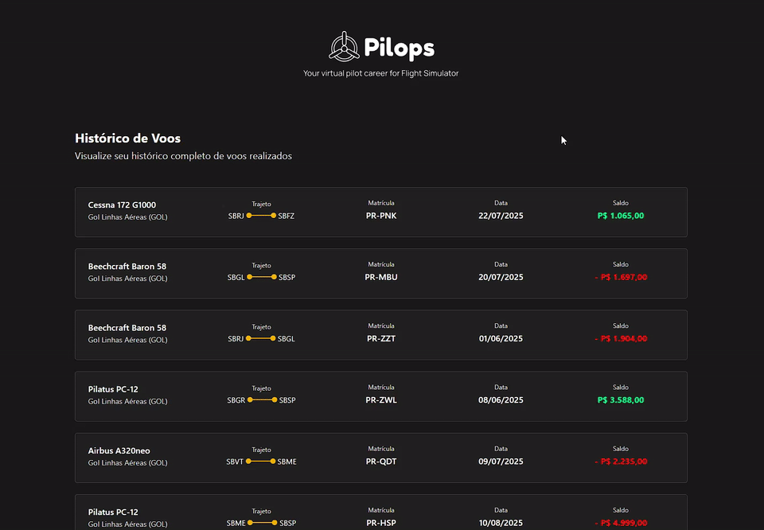

# ✈️ Pilops - Flight History

🇧🇷 Leia isto em [Português](README.md)

> Full-stack application developed as part of the technical challenge for the **Fullstack Software Engineer (Intern/Junior)** role at **Pilops**. The platform allows virtual pilots to manage, view, and track their entire flight history, routes, aircraft registrations, and financial balances from simulator missions.

## 🌐 Deploy / Live Demo

Access the production application:
👉 **[teste-tecnico-pilops.vercel.app](https://teste-tecnico-pilops-bgd4.vercel.app/flights)**

## 📝 About the Project

**Pilops Flight History** is an end-to-end solution for flight operations tracking and analysis. The application consumes structured flight data, providing a scalable REST API with intelligent server-side pagination on the backend, alongside a modern, responsive, and high-performance web interface built with Next.js and Tailwind CSS.

## 🖼️ Preview



## ✨ Features

### 💻 Frontend
- **Infinite Scrolling Feed**: Continuous on-demand batch loading powered by `IntersectionObserver`, ensuring fluid navigation without UI lag.
- **Flight Details View**: Dedicated detail page (`/flights/[id]`) displaying:
  - Route summary (origin & destination).
  - Aircraft model and registration code.
  - Mission rewards (total earnings, gained XP, mission bonus).
  - Breakdown of operating costs (fuel, airport fees, and maintenance).
- **Themed & Responsive Design System**:
  - Native dark mode with a harmonious dark palette and golden/yellow accents.
  - Clean typography configured with **Sora** (headings) and **Manrope** (body & data).
  - Clean vector SVG favicon matching the official brand emblem.
  - Fully responsive across mobile smartphones, tablets, and wide desktop displays.

### ⚙️ Backend (REST API)
- **Paginated Flight Listing**: Dynamic pagination with automatic total page calculation and record count.
- **Flight Details by ID**: Optimized single-record lookup via unique identifier (`id`).
- **Consolidated Total Balance**: Analytical endpoint that calculates cumulative balance across all flight operations with precise currency rounding.
- **CORS & Native ES Modules**: Configured for seamless and secure integration with the client application.

## 🌐 API Endpoints

The API runs by default on `http://localhost:3001` and exposes the following routes:

| Method | Endpoint | Description | Query / Params Example |
| :--- | :--- | :--- | :--- |
| `GET` | `/flights` | Lists flights with pagination | `?page=1&limit=10` |
| `GET` | `/flights/:id` | Returns complete details for a specific flight | `/flights/FL-001` |
| `GET` | `/flights/total-balance` | Returns the cumulative balance of all flights | — |

<details>
<summary>Example response from <code>GET /flights?page=1&limit=2</code></summary>

```json
{
  "currentPage": 1,
  "totalPages": 10,
  "itemsPerPage": 2,
  "totalItems": 20,
  "data": [
    {
      "id": "FL-001",
      "aircraft": {
        "name": "Cessna 172 G1000",
        "registration": "PR-PNK",
        "airline": "Pilops Academy"
      },
      "flightData": {
        "date": "2025-07-22",
        "balance": 1065,
        "route": {
          "from": "SBRJ",
          "to": "SBFZ"
        },
        "xp": 445,
        "missionBonus": 0
      }
    }
  ]
}
```
</details>

## 🛠️ Technologies Used

| Category | Technology |
| :--- | :--- |
| **Frontend** | [![Next.js][Next.js-logo]][Next.js-url] [![React][React-logo]][React-url] [![TypeScript][TypeScript-logo]][TypeScript-url] [![Tailwind-CSS][Tailwind-CSS-logo]][Tailwind-CSS-url] |
| **Backend** | [![NodeJS][NodeJS-logo]][NodeJS-url] [![Express][Express-logo]][Express-url] [![TypeScript][TypeScript-logo]][TypeScript-url] |
| **Quality & Dev** | [![Jest][Jest-logo]][Jest-url] [![ESLint][ESLint-logo]][ESLint-url] [![Git][Git-logo]][Git-url] |

## 📁 Repository Structure

```text
teste-tecnico-pilops/
├── backend/                    # REST API in Node.js + Express + TypeScript
│   ├── src/
│   │   ├── controllers/        # Request & Response HTTP handlers
│   │   ├── data/               # Mock dataset (flightHistory.json)
│   │   ├── routes/             # Route definitions (/flights)
│   │   ├── services/           # Business logic & pagination algorithms
│   │   ├── app.ts              # Express configuration & middlewares
│   │   └── server.ts           # Server bootstrap on port 3001
│   ├── tests/                  # Unit test suite with Jest
│   ├── tsconfig.json           # Backend TypeScript configuration
│   └── package.json
│
├── frontend/                   # Web application in Next.js 15
│   ├── public/                 # Favicons, logos, and vector SVG assets
│   ├── src/
│   │   ├── api/                # HTTP client services (fetch) for the backend API
│   │   ├── app/                # Next.js App Router structure
│   │   │   ├── flights/        # Main flight feed and dynamic [id] route
│   │   │   ├── layout.tsx      # Root layout with fonts & metadata
│   │   │   └── globals.css     # Global stylesheets & Tailwind CSS integration
│   │   ├── components/         # Reusable UI components (Card, Header, BackButton)
│   │   ├── interfaces/         # TypeScript contracts and definitions
│   │   └── utils/              # Helper functions (currency and date formatters)
│   ├── tsconfig.json           # Frontend TypeScript configuration
│   └── package.json
│
├── README.md                   # Documentation (Portuguese)
└── README.en.md                # Documentation (English)
```

## 💡 Technical Decisions

1. **Layered Architecture (Controller-Service-Data)**:
   - **Controllers** handle HTTP requests, validate query/route parameters, and return JSON responses.
   - **Services** encapsulate all business logic (array slicing for pagination, data lookups, and balance aggregations), ensuring code is clean, decoupled, and easy to unit test.

2. **Native ES Modules on Backend (`"type": "module"`)**:
   - The backend was authored using native ES Modules (`import`/`export`) via TypeScript and `tsx`. This aligns with modern JavaScript standards and supports native *Import Attributes* (`with { type: "json" }`).

3. **Infinite Scroll with `IntersectionObserver`**:
   - Rather than forcing traditional paginated button navigation, the client tracks the last element using an `IntersectionObserver` callback ref, triggering the next page fetch seamlessly as the user scrolls.

4. **Next.js 15 App Router & Server/Client Components**:
   - Leveraged React 19 / Next.js 15 component paradigm, separating client interactivity (`"use client"` for dynamic infinite scrolling) while maintaining server-rendered performance for flight details.

5. **Font Optimization with `next/font`**:
   - Utilized `next/font/google` to inject CSS custom properties (`--font-sora`, `--font-manrope`), eliminating render-blocking downloads and layout shifts.

## 🚀 How to Run the Project

### Prerequisites
- **Node.js** installed (version 18.x or higher recommended).
- **npm** or **yarn**.

### 1. Clone the Repository
```bash
git clone https://github.com/ludson96/teste-tecnico-pilops.git
cd teste-tecnico-pilops
```

### 2. Run the Backend

Open a terminal in the project root and run:

```bash
# 1. Navigate to backend directory
cd backend

# 2. Install dependencies
npm install

# 3. Start development server
npm run dev
```

> 🟢 The backend will be available at: `http://localhost:3001`

*(Optional) Run backend tests:*
```bash
npm test
```

### 3. Run the Frontend

Open a **second terminal** and run:

```bash
# 1. Navigate to frontend directory
cd frontend

# 2. Install dependencies
npm install

# 3. Start development server
npm run dev
```

> 🟢 The application will be available at: `http://localhost:3000`

## 👨‍💻 Author

Developed by **Ludson Pereira**  
- [GitHub](https://github.com/ludson96)
- [LinkedIn](https://www.linkedin.com/in/ludson-pereira/)

[Next.js-logo]: https://img.shields.io/badge/Next.js-black?style=for-the-badge&logo=next.js&logoColor=white
[Next.js-url]: https://nextjs.org/
[React-logo]: https://img.shields.io/badge/react-%2320232a.svg?style=for-the-badge&logo=react&logoColor=%2361DAFB
[React-url]: https://reactjs.org
[TypeScript-logo]: https://img.shields.io/badge/typescript-%23007ACC.svg?style=for-the-badge&logo=typescript&logoColor=white
[TypeScript-url]: https://www.typescriptlang.org/
[Tailwind-CSS-logo]: https://img.shields.io/badge/tailwindcss-%2338B2AC.svg?style=for-the-badge&logo=tailwind-css&logoColor=white
[Tailwind-CSS-url]: https://tailwindcss.com/
[NodeJS-logo]: https://img.shields.io/badge/node.js-6DA55F?style=for-the-badge&logo=node.js&logoColor=white
[NodeJS-url]: https://nodejs.org/en/
[Express-logo]: https://img.shields.io/badge/express.js-%23404d59.svg?style=for-the-badge&logo=express&logoColor=%2361DAFB
[Express-url]: https://expressjs.com
[Jest-logo]: https://img.shields.io/badge/-jest-%23C21325?style=for-the-badge&logo=jest&logoColor=white
[Jest-url]: https://jestjs.io
[ESLint-logo]: https://img.shields.io/badge/ESLint-4B3263?style=for-the-badge&logo=eslint&logoColor=white
[ESLint-url]: https://eslint.org/
[Git-logo]: https://img.shields.io/badge/git-%23F05033.svg?style=for-the-badge&logo=git&logoColor=white
[Git-url]: https://git-scm.com
