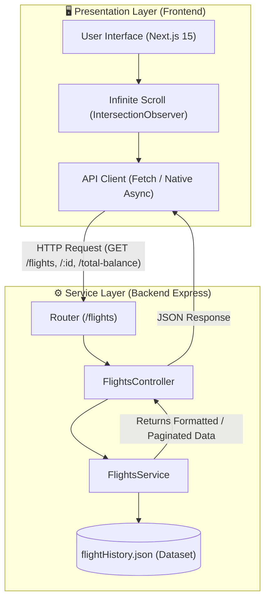

# ✈️ Pilops - Flight History

[](https://nextjs.org/)
[](https://react.dev/)
[](https://www.typescriptlang.org/)
[](https://nodejs.org/)
[](https://expressjs.com/)
[](https://tailwindcss.com/)
[](https://jestjs.io/)

> 🇺🇸 **English** | 🇧🇷 [**Versão em Português**](README.md)

Full Stack application developed as a technical challenge solution for **Pilops**, simulating a flight history and management dashboard for flight simulator virtual pilots.

## 📌 Quick Navigation

- [📝 About the Project](#-about-the-project)
- [🖼️ Preview](#️-preview)
- [🌐 Application Deploy](#-application-deploy)
- [⚡ API Endpoints](#-api-endpoints)
- [✨ Key Features](#-key-features)
- [🛠️ Technologies & Tools Used](#️-technologies--tools-used)
- [🏛️ Solution Architecture](#️-solution-architecture)
- [📁 Repository Structure](#-repository-structure)
- [💡 Technical Decisions](#-technical-decisions)
- [🚀 How to Run the Project](#-how-to-run-the-project)

## 📝 About the Project

**Pilops - Flight History** was created to deliver a smooth, responsive, and modern experience for tracking virtual flight mission logs. The system features a modular backend built with Express + TypeScript offering pagination and financial analytics, alongside a high-fidelity frontend built with Next.js 15 (App Router) and Tailwind CSS, featuring an infinite scrolling feed powered by `IntersectionObserver`.

## 🖼️ Preview


## 🌐 Application Deploy

Access the live production app:
👉 **[Pilops Flight History](https://teste-tecnico-pilops-bgd4.vercel.app/flights)**

## ⚡ API Endpoints

The backend provides a fast, structured RESTful API (default port `3001` in local development):

| Method | Endpoint | Description | Parameters / Example |
| :--- | :--- | :--- | :--- |
| `GET` | `/flights` | Returns a paginated list of flights | `?page=1&limit=10` |
| `GET` | `/flights/:id` | Returns complete details of a specific flight | `/flights/FL-001` |
| `GET` | `/flights/total-balance` | Returns the accumulated financial balance | — |

<details>
<summary>Example Response Payload (<code>GET /flights?page=1&limit=1</code>)</summary>

```json
{
  "currentPage": 1,
  "totalPages": 20,
  "itemsPerPage": 1,
  "totalItems": 20,
  "data": [
    {
      "id": "FL-001",
      "aircraft": {
        "name": "Cessna 172 G1000",
        "registration": "PR-PNK",
        "airline": "Pilops Academy"
      },
      "flightData": {
        "date": "2025-07-22",
        "balance": 1065,
        "route": {
          "from": "SBRJ",
          "to": "SBFZ"
        },
        "xp": 445,
        "missionBonus": 0
      }
    }
  ]
}
```
</details>

## ✨ Key Features

### 💻 Frontend (Web Client)
- **Smart Infinite Scrolling**: Seamless feed monitoring the visibility of the last rendered element via `IntersectionObserver`, preventing pagination interruptions and duplicate network calls.
- **Flight Details Page (`/flights/[id]`)**: Comprehensive overview including route (origin and destination ICAO), aircraft registration, date, monetary earnings, XP earned, and mission bonus percentages.
- **Themed UI & Design System**:
  - Immersive Dark Mode with deep dark backgrounds and gold/yellow accents.
  - Custom typography with Google Fonts (**Sora** and **Manrope**).
  - Modular component library with vector SVG icons and dedicated loading/end-of-feed indicators.
  - Fully responsive across mobile, tablet, and desktop viewports.

### ⚙️ Backend (RESTful Engine)
- **Dynamic Pagination**: Precise `page` and `limit` handling, automatically computing page counts and total dataset items.
- **Targeted ID Lookup**: Optimized endpoint for instant individual record retrieval.
- **Consolidated Balance Aggregation**: Accurate monetary accumulation using array reduction.
- **Modular ES Modules Architecture**: Modern architecture using native `import`/`export`, strict TypeScript typing, CORS headers, and JSON body parsing.

## 🛠️ Technologies & Tools Used

| Layer / Purpose | Technology | Description |
| :--- | :--- | :--- |
| **Frontend Web Framework** | **Next.js 15 (App Router)** | React framework with Server Components support, font optimization, and hybrid rendering |
| **UI Library** | **React 19** | Core library for declarative and reactive user interfaces |
| **Primary Language** | **TypeScript 5** | Strict static typing across 100% of the project (frontend and backend) |
| **Styling** | **Tailwind CSS 4** | Modern utility-first CSS framework for rapid and responsive UI building |
| **Backend & Runtime** | **Node.js (18+) & Express 5** | Lightweight, high-performance HTTP server following Controller-Service architecture |
| **TypeScript Execution** | **tsx** | Ultra-fast execution and live hot-reloading for backend development without build steps |
| **Icons & Assets** | **Lucide React & SVGs** | Clean icon sets and vector graphics |
| **Automated Testing** | **Jest & ts-jest** | Unit testing suite covering backend services and core calculations |
| **Code Quality** | **ESLint** | Static analysis ensuring code consistency and best practices |
| **Deployment & Hosting** | **Vercel** | Hosting platform with automated CI/CD pipelines |

## 🏛️ Solution Architecture


```mermaid
flowchart TD
    subgraph Client ["🖥️ Presentation Layer (Frontend)"]
        UI["User Interface (Next.js 15)"]
        Scroll["Infinite Scroll (IntersectionObserver)"]
        APIClient["API Client (Fetch / Native Async)"]
        UI --> Scroll
        Scroll --> APIClient
    end

    subgraph Backend ["⚙️ Service Layer (Backend Express)"]
        Router["Router (/flights)"]
        Controller["FlightsController"]
        Service["FlightsService"]
        MockData[("flightHistory.json (Dataset)")]

        Router --> Controller
        Controller --> Service
        Service --> MockData
    end

    APIClient -->|"HTTP Request (GET /flights, /:id, /total-balance)"| Router
    Service -->|"Returns Formatted / Paginated Data"| Controller
    Controller -->|"JSON Response"| APIClient
```

## 📁 Repository Structure

```text
teste-tecnico-pilops/
├── backend/                    # Node.js + Express + TypeScript REST API
│   ├── src/
│   │   ├── controllers/        # HTTP Controllers (request validation & response formatting)
│   │   ├── data/               # Structured flight data (flightHistory.json)
│   │   ├── routes/             # Route mapping and definitions (/flights)
│   │   ├── services/           # Business logic, pagination, and data aggregations
│   │   ├── app.ts              # Express configuration, CORS, and middlewares
│   │   └── server.ts           # HTTP server bootstrapping
│   ├── tests/                  # Automated unit tests with Jest
│   ├── tsconfig.json           # TypeScript configuration for backend
│   └── package.json
│
├── frontend/                   # Next.js 15 + Tailwind CSS Web Application
│   ├── public/                 # Static assets, SVG icons, and demo GIF
│   ├── src/
│   │   ├── api/                # API communication clients
│   │   ├── app/                # App Router page directory
│   │   │   ├── flights/        # Flight feed and dynamic [id] view
│   │   │   ├── layout.tsx      # Base layout with font injection and notice banner
│   │   │   └── globals.css     # Global styles and Tailwind configuration
│   │   ├── components/         # Reusable UI components (Card, Header, BackButton, Banner)
│   │   ├── interfaces/         # TypeScript interfaces and type contracts
│   │   └── utils/              # Utility helpers (date and currency formatters)
│   ├── tsconfig.json           # TypeScript configuration for frontend
│   └── package.json
│
├── README.en.md                # English Documentation
└── README.md                   # Portuguese Documentation
```

## 💡 Technical Decisions

1. **Layered Separation of Concerns (Controller-Service-Data)**:
   - **Controllers** strictly manage HTTP transport responsibilities (query parameter parsing, status codes).
   - **Services** encapsulate data filtering, pagination slicing, and business computations, providing a testable and modular design.

2. **Backend Native ES Modules with TypeScript**:
   - Built on native ECMAScript modules (`"type": "module"`) along with TypeScript and `tsx` for high consistency with the modern frontend ecosystem.

3. **Infinite Scrolling with Intersection Observer API**:
   - Implemented via a callback ref on the last rendered card element. This triggers pagination requests only when needed, maintaining optimal DOM performance.

4. **Next.js 15 App Router & Font Optimization**:
   - Optimal combination of Server and Client Components (`"use client"`).
   - Zero-layout-shift font delivery using `next/font/google` for **Sora** and **Manrope**.

## 🚀 How to Run the Project

### Prerequisites
- **Node.js** (version 18 or higher)
- **npm** or **yarn**
- **Git**

### 1. Clone the Repository
```bash
git clone https://github.com/ludson96/teste-tecnico-pilops.git
cd teste-tecnico-pilops
```

### 2. Run the Backend
Open a terminal in the root project directory:

```bash
# Navigate to the backend directory
cd backend

# Install dependencies
npm install

# Start development server
npm run dev
```

> 🟢 The backend will be available at: `http://localhost:3001`

To run backend automated unit tests:
```bash
npm test
```

### 3. Run the Frontend
Open a **second terminal** in the root project directory:

```bash
# Navigate to the frontend directory
cd frontend

# Install dependencies
npm install

# Start development server
npm run dev
```

> 🟢 The web application will be accessible at: `http://localhost:3000` (or direct path `http://localhost:3000/flights`)

<div align="center">
  Developed by <strong>Ludson Pereira dos Santos</strong> 🚀<br />
  <a href="https://www.linkedin.com/in/ludson96/">LinkedIn</a> • <a href="https://github.com/ludson96">GitHub</a> • <a href="mailto:ludson_ps27@hotmail.com">E-mail</a>
</div>
