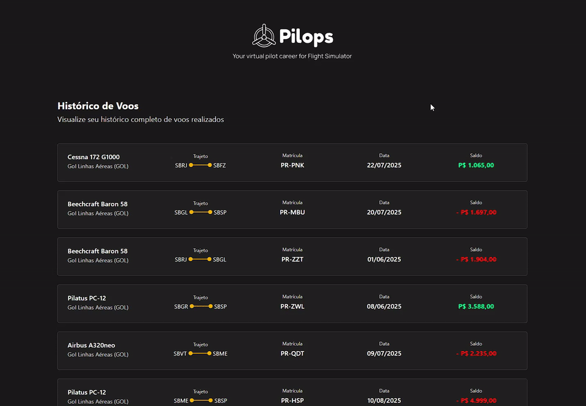
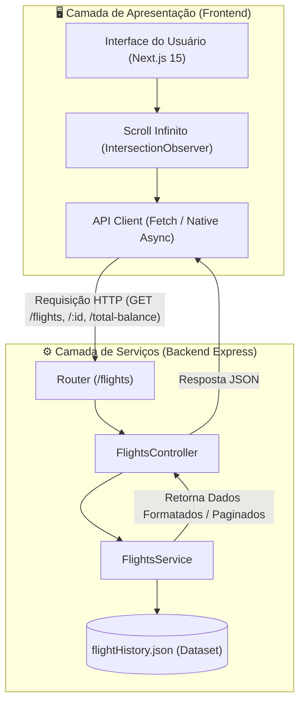

# ✈️ Pilops - Flight History

[](https://nextjs.org/)
[](https://react.dev/)
[](https://www.typescriptlang.org/)
[](https://nodejs.org/)
[](https://expressjs.com/)
[](https://tailwindcss.com/)
[](https://jestjs.io/)

> 🇧🇷 **Português** | 🇺🇸 [**English Version**](README.en.md)

Aplicação Full Stack desenvolvida como solução para o desafio técnico da **Pilops**, simulando um painel de gerenciamento e histórico operacional de voos para pilotos virtuais de simuladores de voo.

## 📌 Navegação Rápida

- [📝 Sobre o Projeto](#-sobre-o-projeto)
- [🖼️ Preview](#️-preview)
- [🌐 Deploy da Aplicação](#-deploy-da-aplicação)
- [⚡ API Endpoints](#-api-endpoints)
- [✨ Funcionalidades](#-funcionalidades)
- [🛠️ Tecnologias e Ferramentas Utilizadas](#️-tecnologias-e-ferramentas-utilizadas)
- [🏛️ Arquitetura da Solução](#️-arquitetura-da-solução)
- [📁 Estrutura do Repositório](#-estrutura-do-repositório)
- [💡 Decisões Técnicas](#-decisões-técnicas)
- [🚀 Como Executar o Projeto](#-como-executar-o-projeto)

## 📝 Sobre o Projeto

O **Pilops - Flight History** foi projetado para oferecer uma experiência fluida, responsiva e moderna na visualização de registros de missões aéreas. O sistema conta com um backend modular construído em Express + TypeScript com paginação e cálculo analítico de métricas financeiras, além de um frontend de alta fidelidade em Next.js 15 (App Router) e Tailwind CSS, incluindo feed com scroll infinito via `IntersectionObserver`.

## 🖼️ Preview



## 🌐 Deploy da Aplicação

Acesse a aplicação em produção:
👉 **[Pilops Flight History](https://teste-tecnico-pilops-bgd4.vercel.app/flights)**

## ⚡ API Endpoints

O backend fornece uma API REST rápida e estruturada (porta padrão `3001` em desenvolvimento local):

| Método | Endpoint | Descrição | Parâmetros / Exemplo |
| :--- | :--- | :--- | :--- |
| `GET` | `/flights` | Lista os voos de forma paginada | `?page=1&limit=10` |
| `GET` | `/flights/:id` | Retorna todos os detalhes de um voo específico | `/flights/FL-001` |
| `GET` | `/flights/total-balance` | Retorna o saldo financeiro consolidado acumulado | — |

<details>
<summary>Exemplo de Payload de Resposta (<code>GET /flights?page=1&limit=1</code>)</summary>

```json
{
  "currentPage": 1,
  "totalPages": 20,
  "itemsPerPage": 1,
  "totalItems": 20,
  "data": [
    {
      "id": "FL-001",
      "aircraft": {
        "name": "Cessna 172 G1000",
        "registration": "PR-PNK",
        "airline": "Pilops Academy"
      },
      "flightData": {
        "date": "2025-07-22",
        "balance": 1065,
        "route": {
          "from": "SBRJ",
          "to": "SBFZ"
        },
        "xp": 445,
        "missionBonus": 0
      }
    }
  ]
}
```
</details>

## ✨ Funcionalidades

### 💻 Frontend (Web Client)
- **Infinite Scrolling Inteligente**: Feed contínuo que monitora a visibilidade do último elemento através de `IntersectionObserver`, eliminando paginações truncadas e requisições repetidas.
- **Página de Detalhamento do Voo (`/flights/[id]`)**: Exibição aprofundada de rota (origem e destino ICAO), matrícula da aeronave, data, ganhos monetários, XP adquirido e percentual de bônus de missão.
- **Design System & UI Temática**:
  - Dark Mode imersivo com tons escuros e acentos vibrantes em ouro/amarelo.
  - Tipografia personalizada com Google Fonts (**Sora** e **Manrope**).
  - Componentização modular com ícones vetoriais em SVG e estados visuais de loading/fim de lista.
  - Totalmente responsivo para dispositivos móveis, tablets e desktops.

### ⚙️ Backend (RESTful Engine)
- **Paginação Dinâmica**: Controle preciso de `page` e `limit`, calculando automaticamente índices, total de páginas e registros.
- **Busca Específica por ID**: Endpoint otimizado para recuperação ágil de registros individuais.
- **Agregação de Saldo Total**: Cálculo monetário consolidado através de reduções de precisão.
- **Arquitetura Modular em ES Modules**: Código moderno utilizando `import`/`export` nativos, TypeScript com tipagem estrita e middlewares de CORS e tratamento JSON.

## 🛠️ Tecnologias e Ferramentas Utilizadas

| Camada / Finalidade | Tecnologia | Descrição |
| :--- | :--- | :--- |
| **Framework Web Frontend** | **Next.js 15 (App Router)** | Framework React com suporte a Server Components, otimização de fontes e renderização híbrida |
| **Biblioteca de UI** | **React 19** | Biblioteca base para construção declarativa de interfaces interativas e reativas |
| **Linguagem Principal** | **TypeScript 5** | Tipagem estática em 100% do projeto (frontend e backend), prevenindo erros em tempo de desenvolvimento |
| **Estilização** | **Tailwind CSS 4** | Utilitários modernos de CSS para desenvolvimento ágil de interfaces customizadas e responsivas |
| **Backend & Runtime** | **Node.js (18+) & Express 5** | Servidor HTTP leve, rápido e configurado com arquitetura Controller-Service |
| **Executor TypeScript** | **tsx** | Execução e hot-reload ultra rápidos no backend sem necessidade de compilação intermediária |
| **Ícones e Assets** | **Lucide React & SVGs** | Conjunto elegante de ícones e ilustrações vetoriais |
| **Testes Automatizados** | **Jest & ts-jest** | Suíte de testes unitários para validação de serviços e regras de negócio no backend |
| **Padronização de Código** | **ESLint** | Validação estática e aplicação de boas práticas e padronização |
| **Deploy & Hospedagem** | **Vercel** | Plataforma de hospedagem e CI/CD para disponibilização contínua do projeto |

## 🏛️ Arquitetura da Solução



## 📁 Estrutura do Repositório

```text
teste-tecnico-pilops/
├── backend/                    # API REST em Node.js + Express + TypeScript
│   ├── src/
│   │   ├── controllers/        # Controladores HTTP (validação de entrada e formatação de resposta)
│   │   ├── data/               # Conjunto de dados estruturados (flightHistory.json)
│   │   ├── routes/             # Definição e mapeamento de rotas (/flights)
│   │   ├── services/           # Regras de negócio, paginação e agregações
│   │   ├── app.ts              # Configuração do Express, CORS e middlewares
│   │   └── server.ts           # Inicialização do servidor HTTP
│   ├── tests/                  # Testes automatizados com Jest
│   ├── tsconfig.json           # Configurações do compilador TypeScript
│   └── package.json
│
├── frontend/                   # Aplicação Web em Next.js 15 + Tailwind CSS
│   ├── public/                 # Assets estáticos, ícones SVG e demonstrativo GIF
│   ├── src/
│   │   ├── api/                # Integração com os serviços da API REST
│   │   ├── app/                # Rotas da aplicação (App Router)
│   │   │   ├── flights/        # Feed de voos e página dinâmica [id]
│   │   │   ├── layout.tsx      # Layout base com injeção de fontes e banner
│   │   │   └── globals.css     # Diretivas Tailwind e estilos globais
│   │   ├── components/         # Componentes reutilizáveis (Card, Header, BackButton, Banner)
│   │   ├── interfaces/         # Contratos e tipos TypeScript
│   │   └── utils/              # Funções utilitárias (formatação monetária e de datas)
│   ├── tsconfig.json           # Configurações TypeScript do frontend
│   └── package.json
│
├── README.en.md                # English Documentation
└── README.md                   # Documentação em Português
```

## 💡 Decisões Técnicas

1. **Separação de Responsabilidades (Controller-Service-Data)**:
   - Os controladores (`controllers`) concentram-se estritamente na comunicação HTTP (status codes, headers, query params).
   - Os serviços (`services`) isolam a lógica de negócios, fatiamento de paginação e cálculos de totais, permitindo fácil testabilidade e manutenibilidade.

2. **Backend em ES Modules com TypeScript**:
   - Utilização de módulos ECMAScript nativos (`"type": "module"`) combinados com TypeScript e `tsx`, possibilitando uma sintaxe moderna em todo o ciclo de vida do projeto.

3. **Infinite Scrolling com Intersection Observer API**:
   - Implementado diretamente através de referências no último card de voo renderizado. Isso assegura consumo sob demanda de recursos de rede e renderização, proporcionando uma experiência contínua sem botões manuais de paginação.

4. **Next.js 15 App Router e Otimização de Fontes**:
   - Uso de Server Components onde a renderização estática/servidor é ideal e Client Components (`"use client"`) onde interatividade e eventos do navegador são exigidos.
   - Aplicação de `next/font/google` para carregar **Sora** e **Manrope** com zero layout shift (CLS zero).

## 🚀 Como Executar o Projeto

### Pré-requisitos
- **Node.js** (versão 18 ou superior instalada)
- Gerenciador de pacotes **npm** ou **yarn**
- **Git**

### 1. Clonar o Repositório
```bash
git clone https://github.com/ludson96/teste-tecnico-pilops.git
cd teste-tecnico-pilops
```

### 2. Executar o Backend
Abra um terminal no diretório do projeto:

```bash
# Navegar até a pasta backend
cd backend

# Instalar as dependências
npm install

# Iniciar o servidor em desenvolvimento
npm run dev
```

> 🟢 O backend estará ouvindo requisições em: `http://localhost:3001`

Para executar os testes unitários do backend:
```bash
npm test
```

### 3. Executar o Frontend
Abra um **novo terminal** na raiz do projeto:

```bash
# Navegar até a pasta frontend
cd frontend

# Instalar as dependências
npm install

# Iniciar o servidor de desenvolvimento
npm run dev
```

> 🟢 A interface web estará disponível em: `http://localhost:3000` (ou rota direta `http://localhost:3000/flights`)

<div align="center">
  Desenvolvido por <strong>Ludson Pereira dos Santos</strong> 🚀<br />
  <a href="https://www.linkedin.com/in/ludson96/">LinkedIn</a> • <a href="https://github.com/ludson96">GitHub</a> • <a href="mailto:ludson_ps27@hotmail.com">E-mail</a>
</div>
